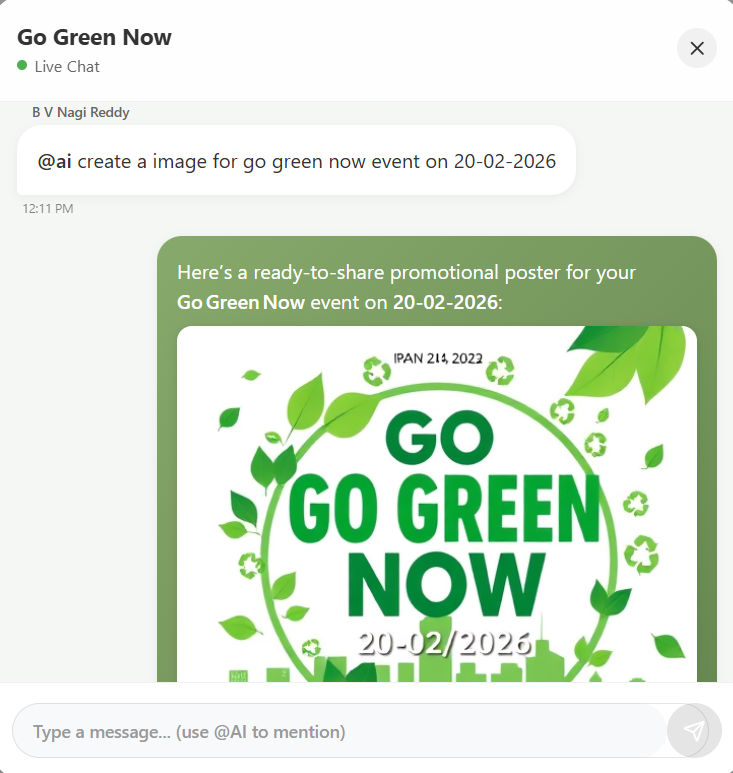

# EcoPulse - AI-Powered Community Engagement Platform

**Transforming New Year's Resolutions into Real-World Community Actions**


---

## 🌟 Project Motivation

### The Problem We're Solving

In today's apartment communities and neighborhoods, **people are increasingly disconnected**. Despite living in close proximity, neighbors rarely interact, and social or outdoor activities seldom happen organically. This disconnection leads to several critical issues:

#### 🚨 Key Challenges

1. **Lack of Social Interaction**
   - Neighbors don't know each other
   - No meaningful conversations or relationships
   - Community feels impersonal and isolated

2. **Environmental Neglect**
   - Plant watering, cleaning, and tree planting are ignored
   - Not because people don't care, but because **nothing is organized**
   - No coordination for sustainability initiatives

3. **Emergency Hesitation**
   - During emergencies, people hesitate to ask for help
   - No clear communication channels
   - Neighbors remain strangers even in crisis

4. **Busy Lifestyles**
   - Everyone is too busy to organize events
   - Lack of time and motivation to foster connections
   - No one takes the initiative to bring people together

5. **Event Organization Barriers**
   - Organizing events is challenging and time-consuming
   - Requires planning, communication, and follow-through
   - Most people lack the skills or confidence to do it

### 💡 The Triggering Moment

This project was born from a simple question asked by an apartment association member during New Year's:

> **"How do we strengthen community interactions and environmental responsibility in our neighborhood?"**

We realized that **people only gather and work together when events are properly organized**. The solution wasn't just about creating events—it was about making event organization **effortless, intelligent, and automated**.

---

## 🎯 Our Solution: EcoPulse

**EcoPulse** is an AI-powered platform that uses **advanced multi-agent systems** to transform individual concerns into collective community actions. Instead of relying on manual effort, we leverage AI agents to:

✅ **Automatically suggest event creation** when users report community issues  
✅ **Guide users step-by-step** through event organization with AI assistance  
✅ **Notify neighbors instantly** when help is needed  
✅ **Enable real-time multilingual communication** via voice and text  
✅ **Rank active participants** to encourage healthy competition and engagement  
✅ **Generate professional promotional materials** (posters, social media posts)  
✅ **Provide vendor recommendations** and local resource discovery  

### Why AI Agents?

We chose an **agent-based architecture** because:

1. **Reduces Friction**: People who want to organize events but lack interaction skills get AI push and guidance
2. **Intelligent Automation**: Agents handle logistics, suggestions, and coordination automatically
3. **Personalized Experience**: Each user gets tailored recommendations based on their community context
4. **Multilingual Support**: Real-time translation breaks language barriers
5. **Proactive Engagement**: AI actively encourages users to create events for community activities


---

## 🏗️ Architecture Overview

EcoPulse is built on a **multi-agent system** powered by:

- **LangGraph** - Multi-agent orchestration framework
- **Groq (Llama 3.3 70B)** - High-performance LLM
- **Opik** - AI observability and evaluation platform
- **FastAPI** - Modern, high-performance web framework
- **PostgreSQL/SQLite** - Persistent state management
- **WebSockets** - Real-time communication
- **Whisper + ElevenLabs** - Voice transcription and synthesis

### Agent Ecosystem

```
┌─────────────────────────────────────┐
│   Green Sentinel (Main Agent)       │
│   - Community assistance            │
│   - Event creation triggering       │
│   - Neighbor help coordination      │
└──────────────┬──────────────────────┘
               │
               ├──► Event Creation Agent
               │    - Step-by-step guidance
               │    - AI-generated descriptions
               │    - Social media automation
               │
               ├──► Event Manager Agent
               │    - Event queries
               │    - Image generation
               │    - Vendor recommendations
               │
               └──► Voice Translation Agent
                    - Real-time transcription
                    - Multilingual translation
                    - Text-to-speech
```

📖 **Detailed Documentation:**
- [Agent Architecture Guide](AGENT_ARCHITECTURE_GUIDE.md) - Complete agent and tool reference
- [System Architecture](ARCHITECTURE.md) - Full technical architecture
- [Opik Integration Guide](OPIK_INTEGRATION_GUIDE.md) - AI observability setup

---

## 🎬 Live Demo Walkthrough

### Scenario 1: Community Environmental Concern

**User reports a community environment issue to Green Sentinel:**


The agent:
1. **Understands the concern** - Analyzes the user's input
2. **Suggests a collaborative solution** - Proposes creating a community event
3. **Guides event creation** - Walks through logistics step-by-step

**Once the user agrees, the Event Creation Agent takes over:**



The agent:
1. **Captures the intent** - Extracts event purpose from conversation
2. **Asks for missing details** - Place, date, time, participants
3. **Auto-generates description** - AI writes compelling 100-char event summary
4. **Creates promotional image** - Generates professional poster automatically
5. **Publishes to community** - Notifies neighbors through intelligent automation

**The event is now live and visible to the entire neighborhood!**

### Scenario 2: User Needs Immediate Help

**When a user needs real assistance:**


The agent:
1. **Detects urgency** - Recognizes help request pattern
2. **Broadcasts to nearest neighbors** - Uses location-based notification
3. **Matches helpers** - Connects user with available community members

**When someone like Nagi responds:**


The user is **instantly notified** that assistance is on the way, creating a safer and more connected community.

---

## 🤖 Key Agent Capabilities

### 🌱 Green Sentinel Agent

**Your 24/7 Community Assistant**

- ✅ Natural language understanding for community concerns
- ✅ Proactive event creation suggestions
- ✅ Neighbor help request broadcasting
- ✅ Community context awareness (facilities, staff, members)
- ✅ Long-term memory of user preferences
- ✅ Web search integration for external information
- ✅ Multilingual conversation support

### 📅 Event Manager Agent

**Your Event Planning Co-Pilot**


- ✅ **Brainstorming Assistant** - Helps ideate event concepts
- ✅ **Image Generation** - Creates professional promotional posters on demand
- ✅ **Social Media Automation** - Writes complete posts with engagement copy and trending hashtags
- ✅ **Vendor Discovery** - Searches for local sustainable food caterers, venues, and services
- ✅ **Event Updates** - Modifies event details through natural conversation

**Example Workflow:**
```
User: "Generate a poster for the tree planting event"
Agent: [Creates professional image with event details]

User: "Write a social media post for Instagram"
Agent: [Generates post with emojis, hashtags, and call-to-action]

User: "Find sustainable food caterers nearby"
Agent: [Searches and lists local eco-friendly vendors]
```

### 🎙️ Voice Translation Agent

**Breaking Language Barriers in Real-Time**

- ✅ Real-time voice transcription (Whisper)
- ✅ Multilingual translation (Llama 3.3 70B)
- ✅ Text-to-speech synthesis (ElevenLabs)
- ✅ Language-specific audio routing
- ✅ Works seamlessly in group conversations

**Example:**
- User A speaks English → User B hears Hindi → User C hears Spanish
- All in real-time with < 3 second latency

---

## 🔍 Unlocking the Agent Black Box with Opik

**The Challenge:**  
Agent boxes look nice from the outside, but there's **no visibility inside**. We don't know:
- What decisions were made?
- What tools were called?
- What was the quality of responses?
- Why did an agent fail or succeed?

Poor outcomes can frustrate users and degrade trust.

**The Solution: Opik Platform**


### Opik Features We Use

✅ **Full Trace Capture** - Every LLM call, tool invocation, and agent decision logged  
✅ **Custom Metrics** - SustainabilityRelevance, CommunityEngagement, ResponseQuality  
✅ **Performance Monitoring** - Latency tracking, success rates, token usage  
✅ **User Feedback Collection** - Sentiment analysis and rating aggregation  
✅ **Experiment Tracking** - A/B test different prompts and models  
✅ **Conversation Analytics** - Understand user engagement patterns  

📖 [Read the full Opik Integration Guide](OPIK_INTEGRATION_GUIDE.md)

---

## 🚀 Features

- ✅ **Multi-Agent AI System** - LangGraph-powered orchestration with 5 specialized agents
- ✅ **19 Intelligent Tools** - API, memory, social media, image generation, external integrations
- ✅ **ReAct Pattern** - Reasoning + Acting loop for intelligent decision-making
- ✅ **Human-in-the-Loop** - 8 interrupt points for user feedback and refinement
- ✅ **Real-Time Voice Translation** - WebSocket-based multilingual voice chat
- ✅ **JWT Authentication** - Secure token-based authentication
- ✅ **Event Management** - Complete lifecycle from creation to execution
- ✅ **Neighbor Help System** - Location-based assistance matching
- ✅ **Social Media Automation** - Auto-generated posts for Twitter, Instagram, LinkedIn
- ✅ **Image Generation** - AI-created event posters and promotional materials
- ✅ **Performance Leaderboard** - Gamified community participation tracking
- ✅ **Full Observability** - Opik integration for AI monitoring and evaluation

## Project Structure

```
opik_Backend/
├── app/
│   ├── __init__.py
│   ├── main.py                 # FastAPI application entry point
│   ├── database.py             # Database configuration
│   ├── dependencies.py         # Auth dependencies
│   ├── api/
│   │   └── v1/
│   │       ├── api.py          # API router
│   │       └── endpoints/
│   │           ├── auth.py     # Authentication endpoints
│   │           └── users.py    # User management endpoints
│   ├── core/
│   │   ├── config.py           # Application settings
│   │   └── security.py         # Security utilities (JWT, password)
│   ├── models/
│   │   └── user.py             # SQLAlchemy models
│   ├── schemas/
│   │   ├── user.py             # Pydantic schemas
│   │   └── token.py            # Token schemas
│   └── crud/
│       └── user.py             # Database operations
├── .env.example                # Environment variables template
├── .gitignore
├── requirements.txt            # Python dependencies
└── README.md
```

## Installation

### 1. Clone the repository

```bash
cd c:\xampp\htdocs\opik_Backend
```

### 2. Create virtual environment

```bash
python -m venv venv
```

### 3. Activate virtual environment

**Windows:**
```bash
venv\Scripts\activate
```

**Linux/Mac:**
```bash
source venv/bin/activate
```

### 4. Install dependencies

```bash
pip install -r requirements.txt
```

### 5. Configure environment variables

```bash
cp .env.example .env
```

Edit `.env` file and update the `SECRET_KEY`:
```
SECRET_KEY=your-generated-secret-key-here
```

Generate a secure secret key:
```bash
python -c "import secrets; print(secrets.token_urlsafe(32))"
```

## Running the Application

### Development Mode

```bash
uvicorn app.main:app --reload
```

### Production Mode

```bash
uvicorn app.main:app --host 0.0.0.0 --port 8000
```

The API will be available at:
- **API**: http://localhost:8000
- **Swagger Documentation**: http://localhost:8000/api/docs
- **ReDoc Documentation**: http://localhost:8000/api/redoc

## API Endpoints

### Authentication

| Method | Endpoint | Description | Auth Required |
|--------|----------|-------------|---------------|
| POST | `/api/v1/auth/signup` | Register new user | No |
| POST | `/api/v1/auth/login` | Login user | No |
| POST | `/api/v1/auth/logout` | Logout user | No |
| POST | `/api/v1/auth/refresh` | Refresh access token | No |

### Users

| Method | Endpoint | Description | Auth Required |
|--------|----------|-------------|---------------|
| GET | `/api/v1/users/me` | Get current user info | Yes |
| PUT | `/api/v1/users/me` | Update current user | Yes |
| GET | `/api/v1/users/` | Get all users | Yes (Superuser) |
| GET | `/api/v1/users/{user_id}` | Get user by ID | Yes (Superuser) |
| DELETE | `/api/v1/users/{user_id}` | Delete user | Yes (Superuser) |

### Health & Info

| Method | Endpoint | Description |
|--------|----------|-------------|
| GET | `/` | Root endpoint |
| GET | `/health` | Health check |

## Usage Examples

### 1. Sign Up

```bash
curl -X POST "http://localhost:8000/api/v1/auth/signup" \
  -H "Content-Type: application/json" \
  -d '{
    "email": "user@example.com",
    "username": "johndoe",
    "password": "securepassword123",
    "full_name": "John Doe"
  }'
```

### 2. Login

```bash
curl -X POST "http://localhost:8000/api/v1/auth/login" \
  -H "Content-Type: application/json" \
  -d '{
    "username": "johndoe",
    "password": "securepassword123"
  }'
```

Response:
```json
{
  "access_token": "eyJhbGc...",
  "refresh_token": "eyJhbGc...",
  "token_type": "bearer"
}
```

### 3. Get Current User Info

```bash
curl -X GET "http://localhost:8000/api/v1/users/me" \
  -H "Authorization: Bearer YOUR_ACCESS_TOKEN"
```

### 4. Refresh Token

```bash
curl -X POST "http://localhost:8000/api/v1/auth/refresh" \
  -H "Content-Type: application/json" \
  -d '{
    "refresh_token": "YOUR_REFRESH_TOKEN"
  }'
```

## Security Features

- **Password Hashing**: Passwords are hashed using bcrypt
- **JWT Tokens**: Stateless authentication with access and refresh tokens
- **Token Expiration**: Access tokens expire in 30 minutes, refresh tokens in 7 days
- **CORS Protection**: Configurable CORS origins
- **Input Validation**: Pydantic models validate all inputs
- **SQL Injection Protection**: SQLAlchemy ORM prevents SQL injection

## Environment Variables

| Variable | Description | Default |
|----------|-------------|---------|
| `APP_NAME` | Application name | OPIK Backend API |
| `SECRET_KEY` | JWT secret key | (required) |
| `ACCESS_TOKEN_EXPIRE_MINUTES` | Access token expiration | 30 |
| `REFRESH_TOKEN_EXPIRE_DAYS` | Refresh token expiration | 7 |
| `DATABASE_URL` | Database connection string | sqlite:///./opik.db |
| `DEBUG` | Debug mode | False |

## Database Schema

### Users Table

| Column | Type | Description |
|--------|------|-------------|
| id | Integer | Primary key |
| email | String | Unique email address |
| username | String | Unique username |
| hashed_password | String | Bcrypt hashed password |
| full_name | String | User's full name (optional) |
| is_active | Boolean | Account active status |
| is_superuser | Boolean | Superuser privileges |
| created_at | DateTime | Account creation timestamp |
| updated_at | DateTime | Last update timestamp |

## Production Deployment

### 1. Update environment variables

Set production values in `.env`:
- Generate a strong `SECRET_KEY`
- Set `DEBUG=False`
- Configure specific CORS origins
- Use production database if needed

### 2. Use production server

```bash
pip install gunicorn
gunicorn app.main:app -w 4 -k uvicorn.workers.UvicornWorker
```

### 3. Use reverse proxy (Nginx)

Configure Nginx to proxy requests to Uvicorn.

### 4. Enable HTTPS

Use SSL certificates (Let's Encrypt) for secure communication.

## Development

### Adding New Endpoints

1. Create new endpoint file in `app/api/v1/endpoints/`
2. Define routes using FastAPI router
3. Register router in `app/api/v1/api.py`

### Adding New Models

1. Create model in `app/models/`
2. Create schema in `app/schemas/`
3. Create CRUD operations in `app/crud/`
4. Update database initialization

## 📚 Documentation

For in-depth technical details, please refer to:

- **[Agent Architecture Guide](AGENT_ARCHITECTURE_GUIDE.md)**
  - Complete catalog of 5 agents
  - Detailed tool inventory (19 tools)
  - Multi-agent orchestration patterns
  - ReAct implementation
  - Human-in-the-loop design
  - Voice LLM system architecture
  - State management with PostgreSQL

- **[System Architecture](ARCHITECTURE.md)**
  - Complete system overview
  - API layer design
  - Real-time communication layer
  - Database schema
  - Deployment architecture
  - Integration patterns

- **[Opik Integration Guide](OPIK_INTEGRATION_GUIDE.md)**
  - Tracing and monitoring setup
  - Custom evaluation metrics
  - Feedback collection system
  - Performance monitoring
  - Experiment tracking
  - Best practices and examples

---

## 🎯 Impact & Vision

### What We've Achieved

✅ **Reduced event organization friction** from hours to minutes  
✅ **Enabled non-technical users** to create professional events with AI guidance  
✅ **Broke language barriers** with real-time multilingual communication  
✅ **Increased community participation** through intelligent nudges and notifications  
✅ **Made sustainability efforts** more organized and collective  

### Our Vision

We envision a future where:
- **Every apartment complex** has an active, engaged community
- **Environmental initiatives** are coordinated and impactful
- **Neighbors know and help** each other in times of need
- **Social isolation** is replaced with meaningful connections
- **AI agents** handle the logistics while humans focus on relationships

---

## 🤝 Contributing

We welcome contributions from the community! Whether it's:
- Bug fixes
- New agent capabilities
- Additional tools
- Documentation improvements
- UI/UX enhancements

Please open an issue or submit a pull request.

---

## 📄 License

MIT License

---

## 👥 Team

**EcoPulse Development Team**

Built with ❤️ for the **Agent Hackathon** to transform New Year's resolutions into real-world community actions.

---

## 🙏 Acknowledgments

- **LangGraph** - For the powerful multi-agent framework
- **Groq** - For lightning-fast LLM inference
- **Opik** - For making AI agents transparent and observable
- **ElevenLabs** - For natural-sounding text-to-speech
- **OpenAI Whisper** - For accurate voice transcription

---

## 📞 Support

For questions, issues, or feature requests:
- Open an issue on GitHub
- Check the [documentation](AGENT_ARCHITECTURE_GUIDE.md)
- Review the [architecture guide](ARCHITECTURE.md)

---

**Let's build connected, sustainable communities together! 🌍🌱**
