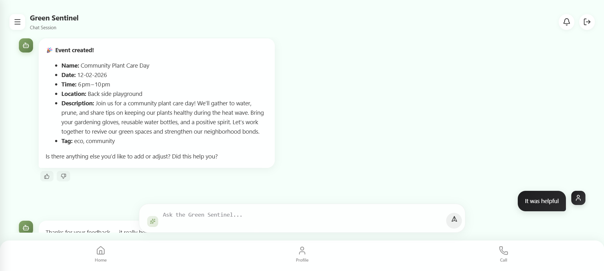
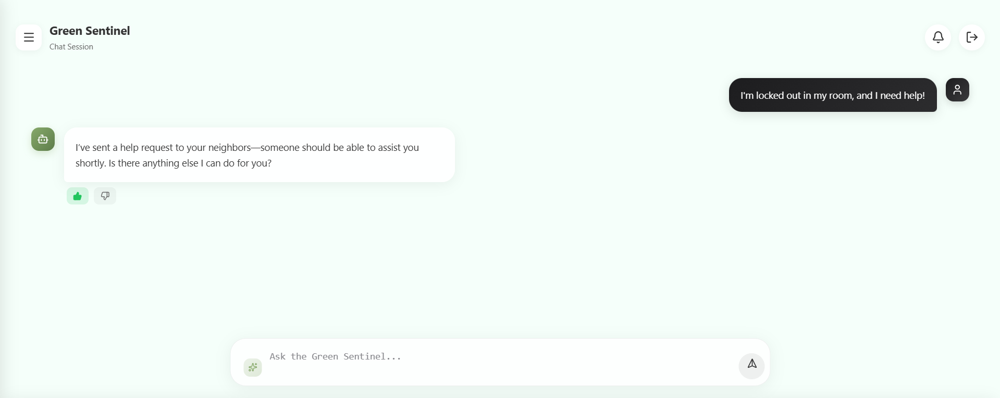
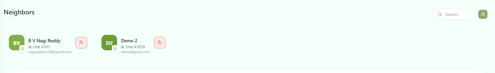
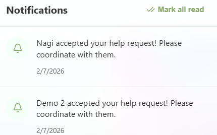
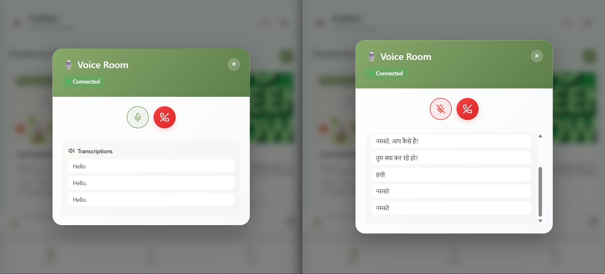
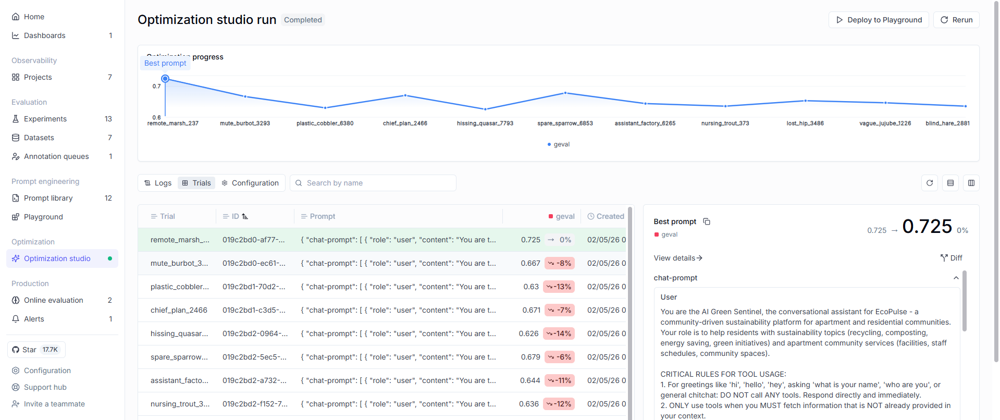
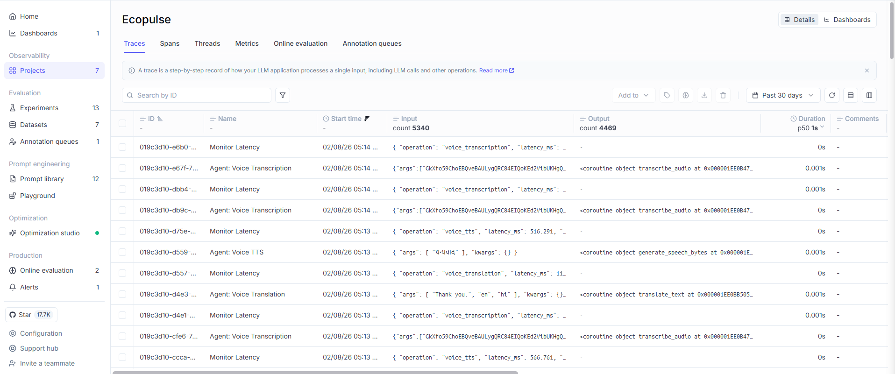
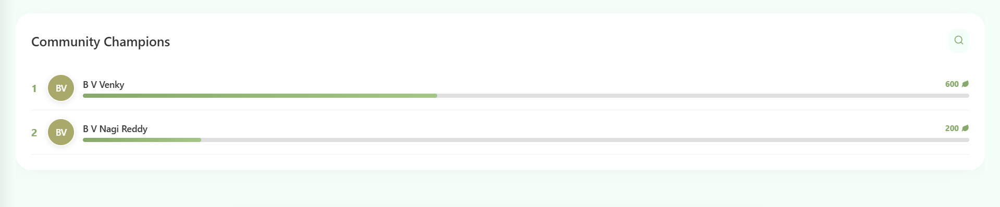
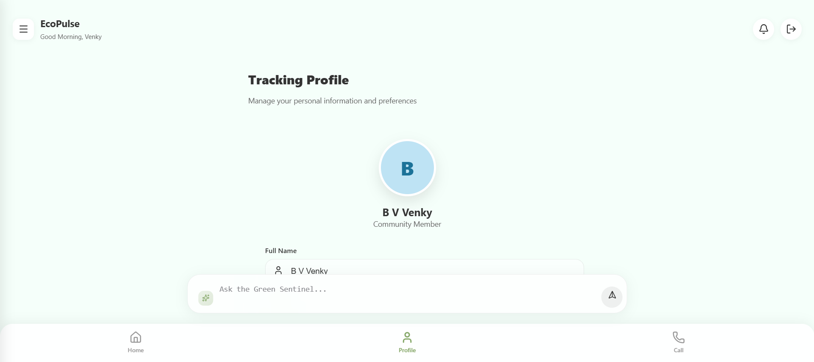
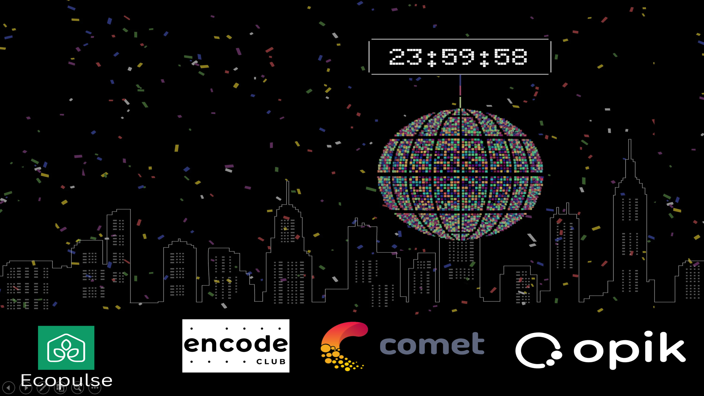

# EcoPulse - AI-Powered Community Engagement Platform

**Transforming New Year's Resolutions into Real-World Community Actions**


---

## 🌟 Project Motivation

### The Problem We're Solving

In today's apartment communities and neighborhoods, **people are increasingly disconnected**. Despite living in close proximity, neighbors rarely interact, and social or outdoor activities seldom happen organically. This disconnection leads to several critical issues:

#### 🚨 Key Challenges

1. **Lack of Social Interaction**
   - Neighbors don't know each other
   - No meaningful conversations or relationships
   - Community feels impersonal and isolated

2. **Environmental Neglect**
   - Plant watering, cleaning, and tree planting are ignored
   - Not because people don't care, but because **nothing is organized**
   - No coordination for sustainability initiatives

3. **Emergency Hesitation**
   - During emergencies, people hesitate to ask for help
   - No clear communication channels
   - Neighbors remain strangers even in crisis

4. **Busy Lifestyles**
   - Everyone is too busy to organize events
   - Lack of time and motivation to foster connections
   - No one takes the initiative to bring people together

5. **Event Organization Barriers**
   - Organizing events is challenging and time-consuming
   - Requires planning, communication, and follow-through
   - Most people lack the skills or confidence to do it

### 💡 The Triggering Moment

This project was born from a simple question asked by an apartment association member during New Year's:

> **"How do we strengthen community interactions and environmental responsibility in our neighborhood?"**

We realized that **people only gather and work together when events are properly organized**. The solution wasn't just about creating events—it was about making event organization **effortless, intelligent, and automated**.

---

## 🎯 Our Solution: EcoPulse

**EcoPulse** is an AI-powered platform that uses **advanced multi-agent systems** to transform individual concerns into collective community actions. Instead of relying on manual effort, we leverage AI agents to:

✅ **Automatically suggest event creation** when users report community issues  
✅ **Guide users step-by-step** through event organization with AI assistance  
✅ **Notify neighbors instantly** when help is needed  
✅ **Enable real-time multilingual communication** via voice and text  
✅ **Rank active participants** to encourage healthy competition and engagement  
✅ **Generate professional promotional materials** (posters, social media posts)  
✅ **Provide vendor recommendations** and local resource discovery  

### Why AI Agents?

We chose an **agent-based architecture** because:

1. **Reduces Friction**: People who want to organize events but lack interaction skills get AI push and guidance
2. **Intelligent Automation**: Agents handle logistics, suggestions, and coordination automatically
3. **Personalized Experience**: Each user gets tailored recommendations based on their community context
4. **Multilingual Support**: Real-time translation breaks language barriers
5. **Proactive Engagement**: AI actively encourages users to create events for community activities



---

## 🏗️ Architecture Overview

EcoPulse is built on a **multi-agent system** powered by:

- **LangGraph** - Multi-agent orchestration framework
- **Groq (Llama 3.3 70B)** - High-performance LLM
- **Opik** - AI observability and evaluation platform
- **FastAPI** - Modern, high-performance web framework
- **PostgreSQL/SQLite** - Persistent state management
- **WebSockets** - Real-time communication
- **Whisper + ElevenLabs** - Voice transcription and synthesis

### Agent Ecosystem

```
┌─────────────────────────────────────┐
│   Green Sentinel (Main Agent)       │
│   - Community assistance            │
│   - Event creation triggering       │
│   - Neighbor help coordination      │
└──────────────┬──────────────────────┘
               │
               ├──► Event Creation Agent
               │    - Step-by-step guidance
               │    - AI-generated descriptions
               │    - Social media automation
               │
               ├──► Event Manager Agent
               │    - Event queries
               │    - Image generation
               │    - Vendor recommendations
               │
               └──► Voice Translation Agent
                    - Real-time transcription
                    - Multilingual translation
                    - Text-to-speech
```

📖 **Detailed Documentation:**
- [Agent Architecture Guide](AGENT_ARCHITECTURE_GUIDE.md) - Complete agent and tool reference
- [System Architecture](ARCHITECTURE.md) - Full technical architecture
- [Opik Integration Guide](OPIK_INTEGRATION_GUIDE.md) - AI observability setup

---

## 🎬 Live Demo Walkthrough

### Dashboard Overview


*Main dashboard showing community activity, events, and quick access to AI agents*

### Scenario 1: Community Environmental Concern

**User engages with Green Sentinel to create a community event:**


*Green Sentinel Agent guiding the user through event creation workflow*

The agent:
1. **Understands the concern** - Analyzes the user's input
2. **Suggests a collaborative solution** - Proposes creating a community event
3. **Guides event creation** - Walks through logistics step-by-step
4. **Auto-generates description** - AI writes compelling event summary
5. **Creates promotional materials** - Generates professional posters and social media posts
6. **Publishes to community** - Notifies neighbors through intelligent automation

**The event is now live and visible to the entire neighborhood!**

### Scenario 2: User Needs Immediate Help

**When a user needs real assistance:**


*User requesting help from neighbors through the AI agent*

The agent:
1. **Detects urgency** - Recognizes help request pattern
2. **Broadcasts to nearest neighbors** - Uses location-based notification
3. **Matches helpers** - Connects user with available community members


*Available neighbors in the community who can provide assistance*

**When someone responds to the help request:**


*User receives notification that a neighbor has accepted to help*

The user is **instantly notified** that assistance is on the way, creating a safer and more connected community.

---

## 🤖 Key Agent Capabilities

### 🌱 Green Sentinel Agent

**Your 24/7 Community Assistant**

- ✅ Natural language understanding for community concerns
- ✅ Proactive event creation suggestions
- ✅ Neighbor help request broadcasting
- ✅ Community context awareness (facilities, staff, members)
- ✅ Long-term memory of user preferences
- ✅ Web search integration for external information
- ✅ Multilingual conversation support

### 📅 Event Manager Agent
Poster Creation](images/4.png)
*Event Manager Agent creating professional promotional posters on demand*

- ✅ **Brainstorming Assistant** - Helps ideate event concepts
- ✅ **Image Generation** - Creates professional promotional posters on demand
- ✅ **Social Media Automation** - Writes complete posts with engagement copy and trending hashtags
- ✅ **Vendor Discovery** - Searches for local sustainable food caterers, venues, and services
- ✅ **Event Updates** - Modifies event details through natural conversation

**Example Workflow:**
```
User: "Generate a poster for the tree planting event"
Agent: [Creates professional image with event details]

User: "Write a social media post for Instagram"
Agent: [Generates post with emojis, hashtags, and call-to-action]

User: "Find sustainable food caterers nearby"
Agent: [Searches and lists local eco-friendly vendors]
```

### 🎙️ Voice Translation Agent

**Breaking Language Barriers in Real-Time**


*Real-time voice-to-voice translation enabling multilingual community conversations
### 🎙️ Voice Translation Agent

**Breaking Language Barriers in Real-Time**

- ✅ Real-time voice transcription (Whisper)
- ✅ Multilingual translation (Llama 3.3 70B)
- ✅ Text-to-speech synthesis (ElevenLabs)
- ✅ Language-specific audio routing
- ✅ Works seamlessly in group conversations

**Example:**
- User A speaks English → User B hears Hindi → User C hears Spanish
- All in real-time with < 3 second latency

---

## 🔍 Unlocking the Agent Black Box with Opik

**The Challenge:**  
Agent boxes look nice from the outside, but there's **no visibility inside**. We don't know:
- What decisions were made?
- What tools were called?
- What was the quality of responses?
- Why did an agent fail or succeed?

Poor ouDashboard](images/10.png)
*Opik Dashboard providing comprehensive AI observability and metrics*

### Opik Features We Use

✅ **Full Trace Capture** - Every LLM call, tool invocation, and agent decision logged  
✅ **Custom Metrics** - SustainabilityRelevance, CommunityEngagement, ResponseQuality  
✅ **Performance Monitoring** - Latency tracking, success rates, token usage  
✅ **User Feedback Collection** - Sentiment analysis and rating aggregation  
✅ **Experiment Tracking** - A/B test different prompts and models  
✅ **Conversation Analytics** - Understand user engagement patterns  


*Opik Optimization Studio running experiments to improve agent performance*


*Detailed traces, spans, and threads showing the complete execution flow of agent interactions* ResponseQuality  
### Core Capabilities

- ✅ **Multi-Agent AI System** - LangGraph-powered orchestration with 5 specialized agents
- ✅ **19 Intelligent Tools** - API, memory, social media, image generation, external integrations
- ✅ **ReAct Pattern** - Reasoning + Acting loop for intelligent decision-making
- ✅ **Human-in-the-Loop** - 8 interrupt points for user feedback and refinement
- ✅ **Real-Time Voice Translation** - WebSocket-based multilingual voice chat
- ✅ **JWT Authentication** - Secure token-based authentication
- ✅ **Event Management** - Complete lifecycle from creation to execution
- ✅ **Neighbor Help System** - Location-based assistance matching
- ✅ **Social Media Automation** - Auto-generated posts for Twitter, Instagram, LinkedIn
- ✅ **Image Generation** - AI-created event posters and promotional materials
- ✅ **Performance Leaderboard** - Gamified community participation tracking
- ✅ **Full Observability** - Opik integration for AI monitoring and evaluation

### Community Champions Leaderboard


*Leaderboard ranking active participants to encourage healthy competition and engagement*

Track and reward the most active community members who organize events, help neighbors, and contribute to sustainability initiatives.

### User Profile Management


*Comprehensive user profile with preferences, participation history, and achievements*

Each user has a personalized profile showing:
- Community membership and roles
- Events organized and attended
- Neighbor help contributions
- Sustainability impact metrics
- Language preferences
- Achievement badgesized agents
- ✅ **19 Intelligent Tools** - API, memory, social media, image generation, external integrations
- ✅ **ReAct Pattern** - Reasoning + Acting loop for intelligent decision-making
- ✅ **Human-in-the-Loop** - 8 interrupt points for user feedback and refinement
- ✅ **Real-Time Voice Translation** - WebSocket-based multilingual voice chat
- ✅ **JWT Authentication** - Secure token-based authentication
- ✅ **Event Management** - Complete lifecycle from creation to execution
- ✅ **Neighbor Help System** - Location-based assistance matching
- ✅ **Social Media Automation** - Auto-generated posts for Twitter, Instagram, LinkedIn
- ✅ **Image Generation** - AI-created event posters and promotional materials
- ✅ **Performance Leaderboard** - Gamified community participation tracking
- ✅ **Full Observability** - Opik integration for AI monitoring and evaluation

## 📚 Documentation

For in-depth technical details, please refer to:

- **[Agent Architecture Guide](AGENT_ARCHITECTURE_GUIDE.md)**
  - Complete catalog of 5 agents
  - Detailed tool inventory (19 tools)
  - Multi-agent orchestration patterns
  - ReAct implementation
  - Human-in-the-loop design
  - Voice LLM system architecture
  - State management with PostgreSQL

- **[System Architecture](ARCHITECTURE.md)**
  - Complete system overview
  - API layer design
  - Real-time communication layer
  - Database schema
  - Deployment architecture
  - Integration patterns

- **[Opik Integration Guide](OPIK_INTEGRATION_GUIDE.md)**
  - Tracing and monitoring setup
  - Custom evaluation metrics
  - Feedback collection system
  - Performance monitoring
  - Experiment tracking
  - Best practices and examples

---

## 🎯 Impact & Vision

### What We've Achieved

✅ **Reduced event organization friction** from hours to minutes  
✅ **Enabled non-technical users** to create professional events with AI guidance  
✅ **Broke language barriers** with real-time multilingual communication  
✅ **Increased community participation** through intelligent nudges and notifications  
✅ **Made sustainability efforts** more organized and collective  

### Our Vision

We envision a future where:
- **Every apartment complex** has an active, engaged community
- **Environmental initiatives** are coordinated and impactful
- **Neighbors know and help** each other in times of need
- **Social isolation** is replaced with meaningful connections
- **AI agents** handle the logistics while humans focus on relationships

---

## 🤝 Contributing

We welcome contributions from the community! Whether it's:
- Bug fixes
- New agent capabilities
- Additional tools
- Documentation improvements
- UI/UX enhancements

Please open an issue or submit a pull request.

---

## 📄 License

MIT License

---

## 👥 Team

**EcoPulse Development Team**

Built with ❤️ for the **Agent Hackathon** to transform New Year's resolutions into real-world community actions.

---

## 🙏 Acknowledgments

- **LangGraph** - For the powerful multi-agent framework
- **Groq** - For lightning-fast LLM inference
- **Opik** - For making AI agents transparent and observable
- **ElevenLabs** - For natural-sounding text-to-speech
- **OpenAI Whisper** - For accurate voice transcription

---

## 📞 Support

For questions, issues, or feature requests:
- Open an issue on GitHub
- Check the [documentation](AGENT_ARCHITECTURE_GUIDE.md)
- Review the [architecture guide](ARCHITECTURE.md)

---

**Let's build connected, sustainable communities together! 🌍🌱**

---

## 🏆 Hackathon & Organizers

This project was built for **Commit To Change: An AI Agents Hackathon**.

- **Mission:** Build AI that turns New Year’s resolutions into real results.
- **Organizers:** Comet and Encode Club


